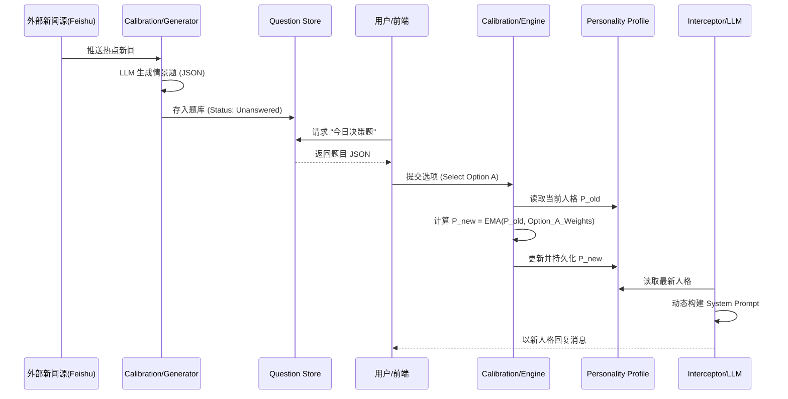

# Soul 模块架构设计方案

Generated: 2025-12-12T19:48:28.920329
Consultant: Gemini Product Architect v1

---

你好。我是首席产品架构师。

针对你提出的 Soul 模块升级计划，这是一个典型的**AI Agent 对齐（Alignment）与治理**问题。在企业级 AI 架构中，Soul 不应仅仅是一个"配置文件读取器"，而应被视为系统的**超我（Super-Ego）**，负责所有的价值判断、行为约束和风格一致性。

以下是基于你的现有代码和业务目标的架构设计方案。

---

### 1. 核心定义：Soul 的职责边界 (Module Boundaries)

**结论：Soul = 静态宪法 (Constitution) + 动态人格 (Personality) + 运行时审计 (Audit)**

你提到的"六维度校准系统"绝对属于 Soul 模块。将 Soul 拆解为以下三个子域：

1.  **Static Constraints (静态约束)**:
    *   **来源**: `boss_constitution.yaml`
    *   **职责**: 定义不可逾越的红线（如：不做假数据、极简主义）。这是系统的"底线"。
2.  **Dynamic Traits (动态特质)**:
    *   **来源**: 六维度模型 (Risk, Time, etc.)
    *   **职责**: 定义系统的"风格"。同一个问题，激进型和保守型人格会有不同的回答。这是系统的"个性"。
3.  **Runtime Governance (运行时治理)**:
    *   **来源**: `interceptor.py`, `alignment.py`
    *   **职责**: 将上述两者注入到每一次交互中，并监控执行结果。

**建议的模块结构调整：**
```text
core/soul/
├── __init__.py          # SoulEngine Facade
├── constitution.py      # [不可变] 宪法加载与索引
├── personality.py       # [可变] 六维度模型状态管理 & 问卷逻辑
├── interceptor.py       # [核心] 拦截器逻辑 (Pre/Post hooks)
├── auditor.py           # [异步] 违规检测与记录 (原 alignment.py)
├── types.py             # 定义 SoulContext, AuditResult 等数据结构
└── prompts/             # 宪法 YAML & 注入模板
```

---

### 2. 拦截器设计 (Interceptor Design)

这是 Soul 模块的心脏。不要把逻辑写死在 LLM 调用处，而是采用 **AOP (面向切面编程)** 的思想。

#### 设计模式：Middleware / Chain of Responsibility

**`core/soul/interceptor.py` 详细设计：**

```python
from typing import Optional, Dict, List
from core.soul.types import SoulContext, AuditLog
from core.soul.constitution import Constitution
from core.soul.personality import Personality

class SoulInterceptor:
    def __init__(self, constitution: Constitution, personality: Personality):
        self.constitution = constitution
        self.personality = personality

    def pre_process(self, user_prompt: str, context: Dict) -> str:
        """
        [同步] 注入阶段
        职责：根据当前上下文，组装 System Prompt
        """
        # 1. 提取宪法核心 (避免全量注入，节省 Token)
        relevant_rules = self.constitution.get_relevant_rules(context.get('task_type'))
        
        # 2. 获取当前人格状态 (如：激进模式)
        persona_prompt = self.personality.render_system_prompt()
        
        # 3. 组装 (Template Pattern)
        injected_prompt = f"""
        [System Directive]
        Identity: {persona_prompt}
        Core Values: {relevant_rules}
        
        [User Request]
        {user_prompt}
        """
        return injected_prompt

    def post_process(self, llm_response: str, context: Dict) -> str:
        """
        [同步/异步混合] 审计阶段
        职责：快速阻断严重违规，异步记录改进建议
        """
        # 1. 快速检查 (Regex/Keyword) - 同步
        if self.constitution.check_hard_blocks(llm_response):
            return "Error: Response blocked by Soul Protocol (Safety Violation)."
            
        # 2. 深度审计 (LLM Evaluation) - 建议异步触发
        # self.auditor.audit_async(llm_response, context)
        
        return llm_response
```

---

### 3. 与 LLM 层的集成方案 (Integration)

你目前有两套调用 (`kernel_codeact.py` 和 `sglang`)，这是典型的技术债。Soul 不应该去适配每一个调用点，而应该提供一个统一的**装饰器**或**上下文管理器**。

**方案 A：装饰器模式 (推荐，改动最小)**

在 `core/soul/__init__.py` 中暴露一个装饰器：

```python
# core/soul/__init__.py
from functools import wraps

def with_soul(action_type="general"):
    def decorator(func):
        @wraps(func)
        async def wrapper(*args, **kwargs):
            # 1. 获取 Soul 实例
            soul = SoulEngine.get_instance()
            
            # 2. Pre-process: 修改 prompt 参数
            # 假设 args[0] 是 prompt，这里需要适配具体的函数签名
            original_prompt = kwargs.get('prompt') or args[0] 
            new_prompt = soul.interceptor.pre_process(original_prompt, {"type": action_type})
            
            # 更新参数
            if 'prompt' in kwargs:
                kwargs['prompt'] = new_prompt
            else:
                args = (new_prompt,) + args[1:]
            
            # 3. Execute LLM
            response = await func(*args, **kwargs)
            
            # 4. Post-process: 审计
            # 触发异步审计，不阻塞主流程
            soul.auditor.submit_task(original_prompt, response)
            
            return response
        return wrapper
    return decorator
```

**集成点：**
*   在 `kernel_codeact.py` 的生成函数上加 `@with_soul(action_type="code_act")`
*   在调用 `sglang` 的封装函数上加 `@with_soul(action_type="coding")`

---

### 4. 数据模型设计 (Data Model)

MongoDB 是合适的选择。我们需要存储三种核心数据：

#### A. PersonalityProfile (人格档案)
*   **Scope**: User 或 Global Agent
*   **Update**: 频率低，通过问卷或长期反馈更新。
```json
{
  "_id": "user_123_soul",
  "dimensions": {
    "risk_appetite": 0.8,      // 0.0-1.0
    "time_horizon": 0.5,
    "strategic_drive": 0.9,
    // ... 其他维度
  },
  "narrative_traits": ["Prefer terse code", "Hates emojis"], // 显性偏好
  "last_updated": "2023-10-27T10:00:00Z"
}
```

#### B. AuditLog (审计日志)
*   **Scope**: 每次 LLM 调用
*   **Update**: 频率高，写操作为主。
```json
{
  "_id": "log_uuid",
  "timestamp": "...",
  "prompt_snapshot": "...",  // 注入后的 prompt
  "response_snapshot": "...",
  "alignment_score": 0.85,   // 审计打分
  "violations": ["prohibited_actions.hide_errors"], // 触发的规则ID
  "correction_suggestion": "Should have explicitly stated the error."
}
```

#### C. ReflectionMemory (反思记忆 - 对应 YAML 中的 self_improvement)
*   **Scope**: 系统级
*   **Update**: 由 AuditLog 聚合触发。
```json
{
  "rule_id": "prohibited_actions.hide_errors",
  "violation_count": 15,
  "learned_pattern": "Model tends to hide errors when context length > 8k",
  "counter_measure": "Inject stronger warning in long-context prompts"
}
```

---

### 5. 风险与 Trade-offs (Risk Analysis)

#### 1. Token 消耗 vs. 规则覆盖率
*   **风险**: `boss_constitution.yaml` 如果很大，每次全量注入会消耗大量 Token 且稀释 LLM 的注意力。
*   **对策**: 实现 **"宪法切片 (Constitution Slicing)"**。
    *   在 `constitution.py` 中建立索引。
    *   如果任务是 "写代码"，只注入 `code_guidelines` + `core_values`。
    *   如果任务是 "闲聊"，只注入 `communication_style`。

#### 2. 延迟 (Latency)
*   **风险**: 在 Post-processing 做深度审计（让 LLM 检查自己是否违规）会使响应时间翻倍。
*   **对策**: **异步审计 + 乐观响应**。
    *   只拦截 Regex 能抓到的明显错误（如敏感词）。
    *   深度的价值观审计（Alignment Check）放入后台队列（Celery/RabbitMQ），不阻塞用户响应。
    *   如果发现严重违规，记录并在*下一次*交互中进行修正（Reinforcement Learning approach）。

#### 3. 人格分裂
*   **风险**: Constitution 要求"极简"，但 Personality (六维度) 设定为"详细解释"。
*   **对策**: **权重优先级**。
    *   Constitution (宪法) > Personality (人格)。
    *   在 Prompt 模板中明确："While your personality is [X], you must strictly adhere to [Y] rules."

### 总结：演进路线图

1.  **Phase 1 (基础管控)**: 实现 `Constitution` 加载器和 `Interceptor` 的 Pre-process 注入。使用 `@with_soul` 装饰器覆盖现有 LLM 调用。
2.  **Phase 2 (数据闭环)**: 实现 `Auditor` (异步)，开始将交互日志存入 MongoDB，用于后续分析。
3.  **Phase 3 (动态人格)**: 将 `soul_api.py` 的问卷逻辑重构进 `personality.py`，让拦截器根据用户档案动态调整 System Prompt。
4.  **Phase 4 (自我进化)**: 基于 AuditLog 自动触发 `Reflection`，动态更新宪法或 Prompt 模板（这是高阶 Agent 的标志）。


---

## 补充：校准系统设计

Updated: 2025-12-12T23:52:49.141624

你好。作为首席产品架构师，我将针对你在 Soul 系统中遗漏的 **"做题校准系统" (Calibration System)** 进行架构设计。

这是一个非常关键的模块。如果没有它，Soul 只是一个静态的 Prompt 模板；有了它，Soul 才能变成一个**"活的"、可进化的数字生命体**。

以下是基于你现有 `soul_api.py` 的深度架构建议。

---

### 1. 模块定位与边界 (Module Boundaries)

**Q: 做题校准系统属于哪里？**

**A: 它是 Soul 的"认知进化引擎" (Cognitive Evolution Engine)。**

它不应该独立于 `core/soul` 之外，而应该是 `soul` 内部的一个核心子模块。
*   **Personality (Model):** 静态的/当前的状态（那个 6 维数据）。
*   **Calibration (Controller):** 改变状态的机制。
*   **Interceptor (View):** 状态的表现层。

**推荐目录结构：**

```text
core/
└── soul/
    ├── __init__.py
    ├── models.py           # 定义 6 维度数据结构 (Value Object)
    ├── profile.py          # 管理用户的当前人格档案 (Entity)
    ├── calibration/        # [新增] 校准子系统
    │   ├── generator.py    # 调用 LLM 生成题目 (Factory)
    │   ├── engine.py       # 核心算法：根据答案计算人格偏移 (Strategy)
    │   └── store.py        # 题库管理 (Repository)
    └── services.py         # 暴露给外部的 API (Facade)
```

---

### 2. 核心设计决策 (Design Decisions)

#### 2.1 题库设计：异步生成 vs 实时生成

**结论：采用"异步生成池 (Async Pool)" 模式。**

*   **问题：** 实时生成 (Real-time) 延迟高（等待 LLM 10-20秒），且容易出现格式错误或低质量题目，导致用户流失。
*   **方案：**
    1.  **Ingest (摄入):** 监听飞书群聊/新闻源，提取摘要。
    2.  **Generate (生产):** 后台 Job 异步调用 LLM 生成题目，存入 `QuestionBank`。
    3.  **Serve (服务):** 用户请求校准时，直接从库中毫秒级读取。

#### 2.2 校准算法：加权移动平均 (EMA)

**结论：拒绝简单的线性累加，使用指数移动平均 (Exponential Moving Average)。**

*   **问题：** 简单的 `current += new_weight` 会导致数值无限膨胀，或者因为一道题的极端选项导致人格突变。
*   **方案：** 人格具有惯性。
    $$ P_{new} = P_{old} \times (1 - \alpha) + W_{choice} \times \alpha $$
    *   $\alpha$ (学习率): 建议设为 0.1 ~ 0.3。表示新的一道题对整体人格的影响程度。
    *   这样设计，人格会**平滑演进**，且永远保持在合理区间（如 -100 到 +100）。

#### 2.3 数据流设计 (Data Flow)



---

### 3. 详细实现建议

#### 3.1 题库去重与生命周期
在 `store.py` 中，题目不仅仅是 JSON，需要元数据：
```python
class Question:
    id: str                 # UUID
    source_news_hash: str   # 新闻内容的 Hash，防止同一新闻生成多题
    created_at: datetime
    tags: List[str]         # [Strategy, Crisis, Funding]
    served_count: int       # 被多少用户回答过
    quality_score: float    # 后续可引入用户点赞/点踩
```

#### 3.2 具体的校准逻辑 (`engine.py`)

```python
class CalibrationEngine:
    def __init__(self, learning_rate=0.2):
        self.alpha = learning_rate

    def calculate_new_profile(self, current_profile: dict, option_weights: dict) -> dict:
        new_profile = current_profile.copy()
        
        for dim, weight in option_weights.items():
            # 核心公式：旧值 * (1-α) + 新值 * α
            # 假设维度范围是 -100 到 100
            current_val = current_profile.get(dim, 0)
            
            # 归一化输入权重：假设 option_weight 是 -30 到 +30
            # 我们直接将其视为"目标方向的拉力"
            
            updated_val = current_val * (1 - self.alpha) + weight * self.alpha
            
            # 边界钳制
            new_profile[dim] = max(-100, min(100, updated_val))
            
        return new_profile
```

---

### 4. 用户体验与产品策略

#### 4.1 冷启动 vs 持续校准
*   **Onboarding (冷启动):** 用户初次使用时，强制进行 "5-Question Sprint"。通过 5 道涵盖不同维度的高权重题目，快速建立基准人格。此时 $\alpha$ 可以设高一点 (0.5)。
*   **Daily Ritual (持续校准):** "CEO 的晨间决策"。每天早上推送到飞书一道题。这是保持用户粘性的钩子，同时微调人格。

#### 4.2 强制校准 (Consistency Check)
如果系统检测到用户的自然对话风格（通过 Interceptor 分析）与 Soul 档案严重不符：
*   **触发器：** 连续 3 次对话的情感/决策逻辑与 Profile 预测相反。
*   **动作：** 弹出 "人格同步挑战"。
    > "系统检测到您的决策风格发生变化，请处理以下突发情况以更新您的数字孪生..."

#### 4.3 可视化
不要只给数字。在前端/飞书卡片中展示**雷达图 (Radar Chart)** 的变化。
*   显示 "Before" (灰色虚线) 和 "After" (实线)。
*   提供反馈文案："你现在的决策风格更偏向【激进扩张】，与 Elon Musk 的相似度提升了 5%。"

---

### 5. 与 Interceptor 的联动

这是闭环的关键。

**System Prompt 必须是动态的。**
不要把人格写死在 Prompt 字符串里。

```python
# interceptor.py 伪代码

def build_system_prompt(user_id):
    profile = soul_service.get_profile(user_id)
    
    # 将数值转化为形容词，LLM 对形容词更敏感
    risk_desc = "极其保守" if profile.risk < -50 else "赌徒心态"
    
    prompt = f"""
    你现在的核心人格设定如下：
    1. 风险偏好: {risk_desc} (当前值: {profile.risk})
    2. 决策风格: ...
    
    在回答问题时，必须严格遵循上述倾向。
    """
    return prompt
```

**是否需要"人格锁定"？**
*   **需要。** 在某些严肃的业务场景（如自动回邮件），用户不希望 AI 今天是激进派，明天变保守派。
*   **功能：** 提供 `Lock Profile` 开关。开启后，做题只记录数据但不更新生效的 Profile，或者需要手动确认更新。

---

### 6. MVP 实施路径 (Roadmap)

作为架构师，我建议分三步走：

**Phase 1: 基础闭环 (The Skeleton)**
*   实现 `models.py` 和 `profile.py` (JSON 文件存储即可)。
*   写死 5 道通用的商学院题目在代码里。
*   实现简单的 `engine.py` (加权平均)。
*   **目标：** 用户回答 5 题，System Prompt 发生改变。

**Phase 2: 动态题库 (The Flow)**
*   接入飞书机器人 API，监听特定新闻频道。
*   实现 `generator.py`，将新闻转为 JSON 存入 SQLite/Redis。
*   实现每日推送逻辑。
*   **目标：** 每天有新题，内容与时俱进。

**Phase 3: 深度校准 (The Soul)**
*   引入 EMA 算法和平滑机制。
*   实现雷达图可视化反馈。
*   加入 "一致性检测" (Interceptor 反向反馈)。
*   **目标：** 建立用户对"数字分身"的信任感。

### 总结
你之前的设计缺少的不是代码，而是**"状态管理的闭环"**。做题校准系统本质上是一个**状态机 (State Machine)** 的触发器。按照上述架构，将其作为 `soul` 的子模块，利用异步生成和 EMA 算法，可以构建一个既稳健又灵动的系统。
